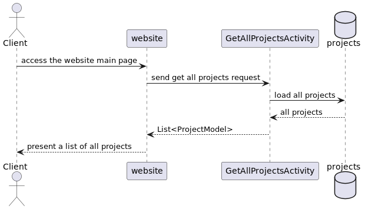
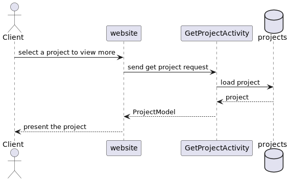
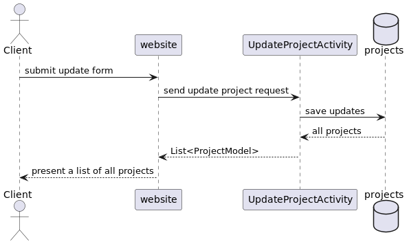
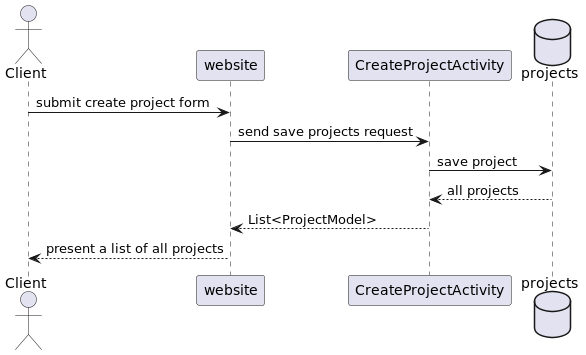
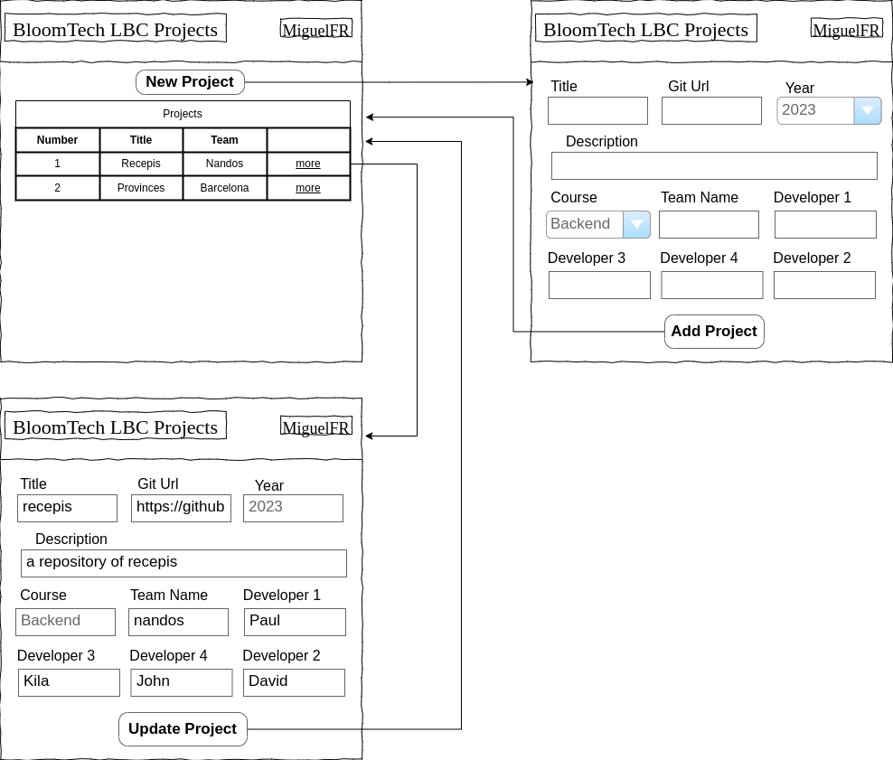

# MiguelFR Design Document

## LBC Projects Repository Design

## 1. Problem Statement

Learn and Be Curious Projects Repository (LBC-PR) is a service to save past LBC projects so future students
can check and be inspired for their own projects ideas. 

## 2. Top Questions to Resolve in Review

1. Should I have a table developer and relate it with the table team and the table team to table project or should just
have a list of members in the table team ?  
2. Should the dev have the information about their course or should it be in the project ?  
3. Should the projects table have fields for beginning and end date of the projects ? Will I be able to deal with date fields ?
4. In the table Project should the title of the project be the primary key or use id ?

## 3. Use Cases

U1. As a [LBCPR] user, I want to be able to register a project with a title, course, year, description, git url,
and the dev team(name, List of members).
U2. As a [LBCPR] user, I want to view a list of all past LBC projects when I access the service.
U3. As a [LBCPR] user, I want to select a project from the list to view more details of the project.
U4. As a [LBCPR] user, I want to be able to update the: title, description, gitUrl and team name of a project.

## 4. Project Scope

### 4.1. In Scope

* Create a project.
* List all projects.
* Update a project.

### 4.2. Out of Scope

* Search a project by any specific field.
* Manage a team.
* Manage courses.
* Delete operations.

# 5. Proposed Architecture Overview

* This service will provide the functionalities to create, update and list all the projects.

* We will use the API Gateway and Lambda to create four endpoints (GetAllProjects, GetProject, UpdateProject, CreateProject).

* Projects and Teams will be stored in separated tables in DynamoDB.

* We will provide a web interface to create a project, view the list of all
projects, select a project in the list to view more and update some information: title, description, gitUrl and team name. 

# 6. API

## 6.1. Public Models

// ProjectModel

String id;
String title;
String description;
String course;
String gitUrl;
Integer year;
String teamId;

// TeamModel

String id;
String name;
List<String> members;

## 6.2. Get AllProjects Endpoint

* Accepts GET requests to /projects and returns the list of all projects.
    * if there is no project in the database return an empty list.
    

## 6.3 Get Project Endpoint

* Accepts GET requests to /projects/:id
* Accepts a project ID and returns the corresponding ProjectModel.
    * if there is no project with that ID, a ProjectNotFoundException will be thrown.

## 6.4 Update Project Endpoint

* Accepts PUT requests to /projects/:id
* Accepts data (ID, title, description, gitUrl and team name) to update the project with that ID. 
Returns the updated Project.
    * if there is no project with that ID, will throw a ProjectNotFoundException

## 6.5 Create Project Endpoint

* Accepts POST requests to /projects
* Accepts data (title, description, gitUrl, team name and a list of team members) to create a new project.
  Returns the new Project, including a unique project ID assigned by the LBC-PR service.

# 7. Tables

## 7.1. projects
*id          // partition key, string*
*title       // string*
*description // string*
course      // string \br
gitUrl      // string
year        // number
teamId      // string

## 7.2 teams
id      // partition key, string
name    // string
members // list

# 8. Pages

